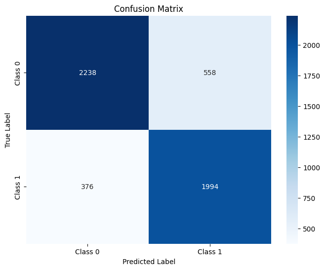
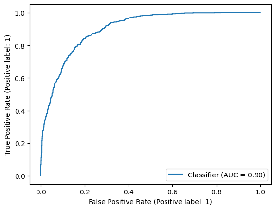

# Spanish Political Alignment Classifier

## Project Intro/Objective
The purpose of this project is define a classification technique to assign a party to Spanish Parliamentary debate speeches. 

## Project Description

### Data Description
The data comes from an open source project called ParlaMint. ParlaMint aims to aggregate and annotate parliamentary debates in Europe. Currently, the project has speech documents from 29 countries and parliament groups, fully transcribed and annotated in multiple languages. Additionally, the project team at ParlaMint has worked to create extensive metadata for each of the speeches, including speaker names, party affiliations, gender, age and position.

The Spanish corpus consists of 32,551 speeches from the Spanish parliament. The speeches span 8 years from 2015 to 2023, and includes 5 legislative terms. Over the course of the 5 legislative terms there were 445 sessions where speakers on average talked 27 times.

### Data Processing

We preprocessed the data, removing punctuations and stop words, dealing with miscellaneous characters, and lemmatizing the corpus. 

We added features including speaker birth years, gender, party in power, and the legislative term. Finally, we tokenized the data for classification. 

After running several models, we concluded that there were 'giveaway' words that were too powerful, such as 'left' and 'right.' We compiled a list of these terms and removed them from our corpus. 

### Model Overview

We trained our model with the two dominant Spanish parties: left - Spanish Socialist Workers' Party (PSOE), and right - People's Party (PP) speeches. We then tested our model on out of sample PP and PSOE data, and again with more extreme left and right parties. We saw strong results for PP-PSOE and VOX-Podemos (extremist right-left); however, the other parties we tested had data size limitations and often focused on more regional issues that were not captured by our training data set. 

We tested a random assignment benchmark, a random forest classifier, and an XGBoost classifier. The XGBoost classifier performed the best with .90 ROC indicating strong performance. Here we can see our XGBoost classifier performance.

Below we can see the ability of the classifier to determine PP vs PSOE (main left and right parties respectively in Spain), and also the trained model's ability to determine the difference between VOX and Podemos (two additional more extreme left vs right respectively parties). 

Here we can see the XGBoost binary classifier out of sample test data with PP (0) and PSOE (1) speech data with a clear separation of left vs right between the parties. 

Here we can see the XGBoost classifier's predictive power with out of sample VOX (0) and Podemos (1) speech data showing clear distinction between the parties. 

## Getting Started

1. Clone this repo (for help see this [tutorial](https://help.github.com/articles/cloning-a-repository/)).
    
